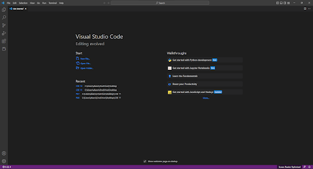
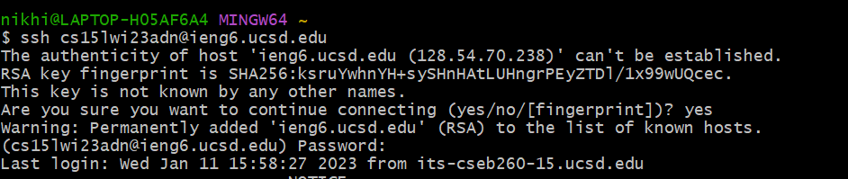
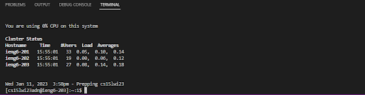
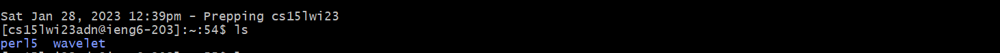
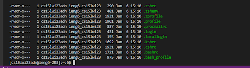
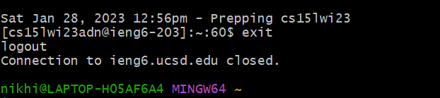

# Lab Report 1

* First, we had to reset our passwords into a more secure password
* We also had to install VS code if we did not already have it and did not want to use the school computers

---

* Gitbash was downloaded next, and set to the as the default terminal
* Next, in order to connect to the ssh a command was inputted to the terminal: **cs15lwi23zz@ieng6.ucsd.edu**

---

* In order to connect properly, the zz in the code has to be replaced by the class spcecific code given during the password reset
* A message is displayed during the first time connecting to the server, and at this point we had to click yes in order to continue
* After a successful connection, this is what the message displayed should look like

---

* After this different commands were tried through the ssh connection
* cd changes the directory within the folder
* ls displays all the files and directories within the location

---

* cp is used to create a copy of the files in a given file or directory
* cat reads the data from files and displays the contents 

---

* Once this was completed, this program was exited, either through ctrl D or command `exit`
* 
