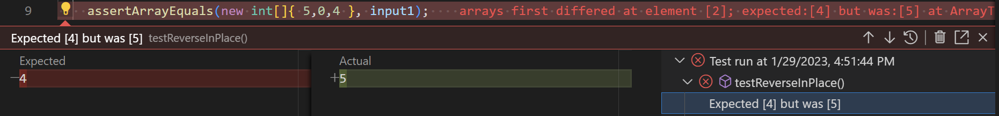
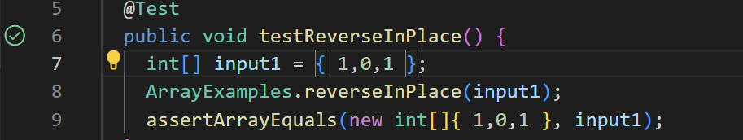

# Lab Report 2

* One of the bugs in this lab was in the testreverseinplace method
* This method is supposed to print the input in reverse, but has a bug

## This is an input for the program that doesn't work
```
int[] input1 = {4,0,5};
ArrayExamples.reverseInPlace(input1);
assertArrayEquals(new int[]{4,0,5},ArrayExamples.reverseInPlace(input1);
```



---

## This is an input for the program that works
```
int[] input1 = {1,0,1};
ArrayExamples.reverseInPlace(input1);
assertArrayEquals(new int[]{1,0,1},ArrayExamples.reverseInPlace(input1);
```



---

## This is the code while the program is bugged

```
static void reverseInPlace(int[] arr) {
    for(int i = 0; i < arr.length; i += 1) {
      arr[i] = arr[arr.length - i - 1];
    }
  }
```
## This is the code while the program is functioning as expected

```
static void reverseInPlace(int[] arr) {
    for(int i = 0; i < arr.length / 2; i += 1) {
      int temp = arr[i]
      arr[i] = arr[arr.length - i - 1];
      arr[arr,length - i - 1] = temp;
    }
 }
 ```
