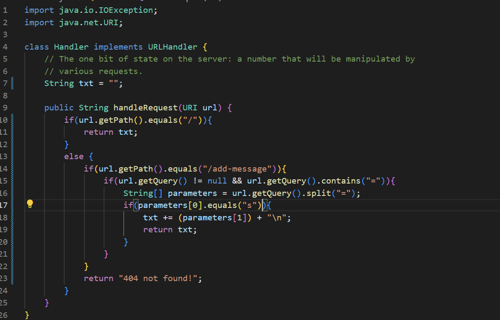
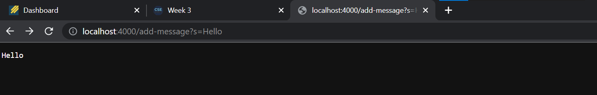
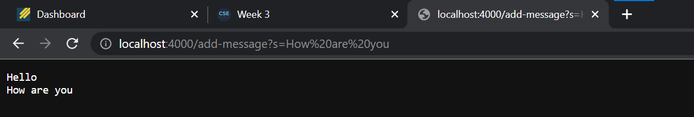

# Lab Report 2



* This is the code for the Stringserver
* It takes a string in the query and prints it, and every additional string that is added in printed under the previous

---



* The getPath is called in order to return the path component of a URI
* The getQuery method returns the query of a url
* The contains method checks whether a string contains given characters
* The split method splits the string after the given parameter
* The parameter that is inside the split method is important as after that is where the message is read


---



* The value that changes in this example is the /n, which modifies the message displayed on the webserver


* One of the bugs in this lab was in the testreverseinplace method
* This method is supposed to print the input in reverse, but has a bug

## This is an input for the program that doesn't work
```
int[] input1 = {4,0,5};
ArrayExamples.reverseInPlace(input1);
assertArrayEquals(new int[]{4,0,5},ArrayExamples.reverseInPlace(input1);
```


---

## This is an input for the program that works
```
int[] input1 = {1,0,1};
ArrayExamples.reverseInPlace(input1);
assertArrayEquals(new int[]{1,0,1},ArrayExamples.reverseInPlace(input1);
```


---

## This is the code while the program is bugged

```
static void reverseInPlace(int[] arr) {
    for(int i = 0; i < arr.length; i += 1) {
      arr[i] = arr[arr.length - i - 1];
    }
  }
```
## This is the code while the program is functioning as expected

```
static void reverseInPlace(int[] arr) {
    for(int i = 0; i < arr.length / 2; i += 1) {
      int temp = arr[i]
      arr[i] = arr[arr.length - i - 1];
      arr[arr,length - i - 1] = temp;
    }
 }
 ```
 
* The old code didn't copy the integers to the correct positions. The last output was always the same as the first output.
* The new method fixed this by only looping halfway through the array but swapping the index of matching integers every cycle.


* I leanred a lot throughout this week that I didn't know before. One of the more significant advancements in my knowledge was in error testing, as this is something that I can use in my other programming classes as well. The step by step process of testing different inputs, finding out exactly where the error is, and fixing it is something I wasn't too familiar with. By learning these skills and improving with Junit, I think my origramming will improve greatly.
