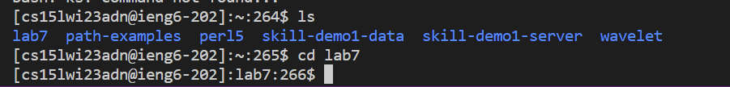
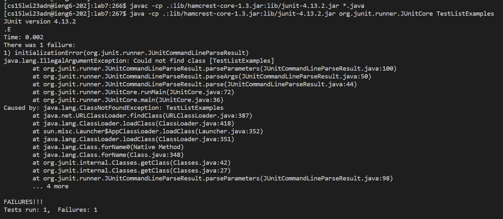
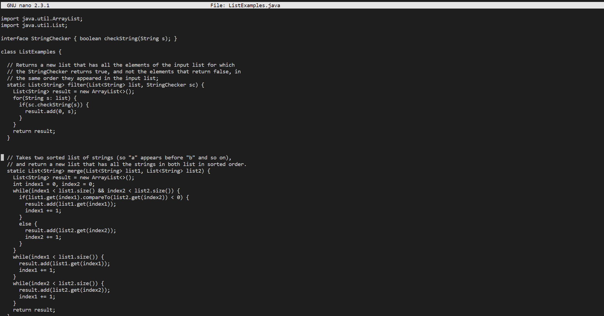
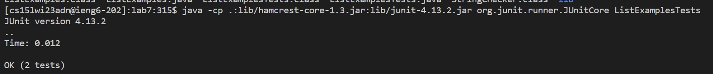

# Lab Report 4

1) ssh cs15lwi23adn@ieng6.ucsd.edu

2) git clone git@github.com:nmahendrann/lab7.git

3) cd into lab7

4) javac -cp .:lib/hamcrest-core-1.3.jar:lib/junit-4.13.2.jar *.java
java -cp .:lib/hamcrest-core-1.3.jar:lib/junit-4.13.2.jar org.junit.runner.JUnitCore TestListExamples

5) nano ListExamples.java

[fix the index1 into index 2]

ctrl o to write change, enter to save it

control x, then enter to leave the nano

5) javac -cp .:lib/hamcrest-core-1.3.jar:lib/junit-4.13.2.jar *.java
java -cp .:lib/hamcrest-core-1.3.jar:lib/junit-4.13.2.jar org.junit.runner.JUnitCore ListExamplesTests

6) git add ListExamples.java

git commit -m “fixed”gr

git push

