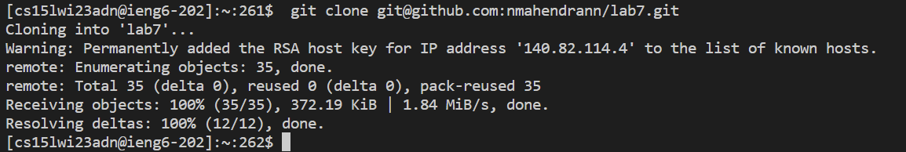
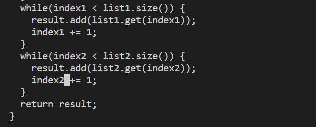
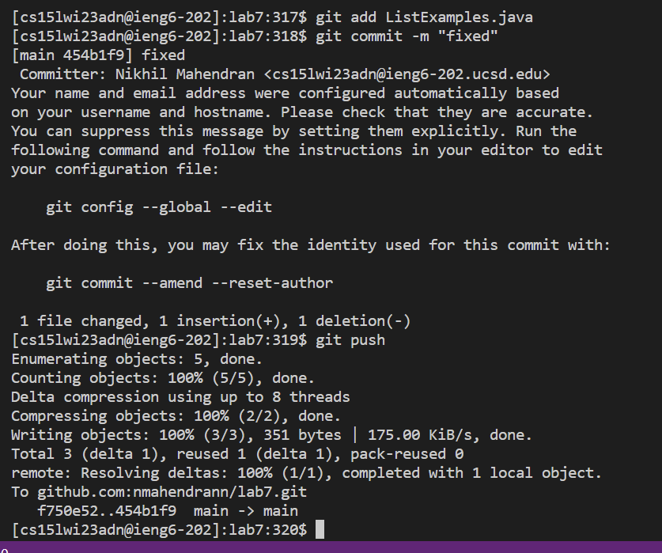

# Lab Report 4

1) ```ssh cs15lwi23adn@ieng6.ucsd.edu ```

* This command was written as is in order to log into to the ieng6 server


2) ```git clone git@github.com:nmahendrann/lab7.git```

* This command is use to clone the lab7 respository



3) ```ls```

   ```cd lab7```
   
   * ls was used to make sure the respository was cloned

* The cd command then changes the current directory into lab 7


4) 
* ```javac -cp .:lib/hamcrest-core-1.3.jar:lib/junit-4.13.2.jar *.java```
* ```java -cp .:lib/hamcrest-core-1.3.jar:lib/junit-4.13.2.jar org.junit.runner.JUnitCore TestListExamples```

* This command compiles and runs the files inside the lab7 directory. It shows that there is one error within the code.


5) ```nano ListExamples.java```

* This command allows the code to be viewed and edited within the terminal


* fixed the index1 into index 2




* ctrl o to write change, enter to save it

* ctrl x after in order to leave nano

5) 
* ```javac -cp .:lib/hamcrest-core-1.3.jar:lib/junit-4.13.2.jar *.java```
* ```java -cp .:lib/hamcrest-core-1.3.jar:lib/junit-4.13.2.jar org.junit.runner.JUnitCore ListExamplesTests```

* There is a shortcut for this step, where ctrl r can be pressed, then when java is typed the code can be compiled immediately after enter. 
* After compilation, a shortcut to run the test is to ctrl r, then type javac and enter to run it. 
* I did these techniques in class when there was a time limit, but copied it for this trial.


6) 

* ```git add ListExamples.java```

* ```git commit -m “fixed”```

* ```git push```

* These commands are used to make changes and upload it to the git respository. Git add adds a change to the working directory, then git commit commits the changes. Git push then uploads these changes to the respository



