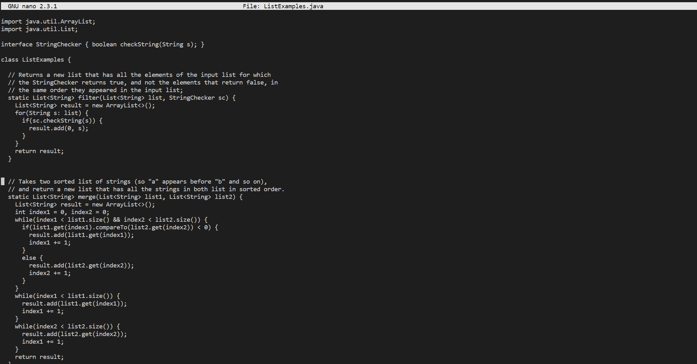

## Speedrunning Lab

* This was my favorite lab as it was fun to see everyone come up with new techniques to do a set of tasks
* I used some shortcuts like the SSH keys and ctrl r to avoid copy pasting and save some time, bringing my pr to 1 minute 30.
* The most time consuming activity was editing the file in nano, which another group was able to cut down through a command

* However faster than all these methods would be creating a bashscript to instantly do all these tasks.

* The sequences of commands I used during the lab were these:
* ```ssh cs15lwi23adn@ieng6.ucsd.edu ```
* ```git clone git@github.com:nmahendrann/lab7.git```
* ```ls```
* ```cd lab7```
* ```javac -cp .:lib/hamcrest-core-1.3.jar:lib/junit-4.13.2.jar *.java```
* ```java -cp .:lib/hamcrest-core-1.3.jar:lib/junit-4.13.2.jar org.junit.runner.JUnitCore TestListExamples```
* ```nano ListExamples.java```
* * fixed the index1 into index 2
* * ctrl o, enter, ctrl x
* ```javac -cp .:lib/hamcrest-core-1.3.jar:lib/junit-4.13.2.jar *.java```
* ```java -cp .:lib/hamcrest-core-1.3.jar:lib/junit-4.13.2.jar org.junit.runner.JUnitCore ListExamplesTests```
* ```git add ListExamples.java```
* ```git commit -m “fixed”```
* ```git push```

* A change a made to this code before placing it in the bashscript is using the ```sed -i``` to replace index1 without entering nano

* These commands can be inputted into a bashscript which can be saved as anything, speedrun_script.sh for example
* 
* The SSH keys made for the lab will be reused in this version of the speedrun.
* The script is made runnable by running ```chmod +x Speedrun_script.sh```
* 
* The script was in downloads so I used ```cd downloads``` in order to run it
* Finally this script can be ran with the terminal input ```./Speedrun_script.sh```
* 

* This should produce the same output as the other lab, but with only one command.

